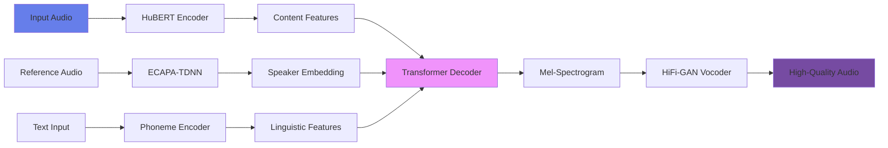

<div align="center">

<a href="https://www.artisticimpression.org/" target="_blank">

</a>

# 🎙️ MikoEcho

### Production-Grade Voice Cloning & Text-to-Speech System


[](LICENSE)
[](https://www.python.org/downloads/)
[](https://pytorch.org/)
[](https://github.com/ArtisticImpression/MikoEcho)
[](CONTRIBUTING.md)

**Clone any voice • Generate natural speech • Control emotions • Real-time capable**

[🚀 Quick Start](#-quick-start) • [📚 Documentation](#-documentation) • [🎯 Features](#-features) • [💻 Demo](#-demo) • [🤝 Contributing](#-contributing)

---

</div>

## ✨ What is MikoEcho?

**MikoEcho** is an advanced, open-source voice cloning and text-to-speech system that can:

- 🎤 **Clone any voice** from just 3-30 seconds of audio
- 📝 **Generate natural speech** from text in cloned voices
- 🎭 **Control emotions** with 10+ emotional styles
- 🔄 **Convert voices** in real-time
- 🌍 **Support any language** with zero-shot learning
- ⚡ **Run efficiently** on GPU or CPU

<div align="center">

### 🎬 See It In Action


</div>

---

## 🎯 Features

<table>
<tr>
<td width="50%">

### 🎙️ Voice Cloning
- Clone voices from minimal audio
- High-fidelity reproduction
- Speaker-agnostic architecture
- Multi-speaker support

### 📝 Text-to-Speech
- Natural prosody generation
- Emotion and style control
- Real-time synthesis
- Batch processing

</td>
<td width="50%">

### 🎭 Advanced Controls
- 10+ emotion modes
- Speech rate adjustment
- Pitch control
- Voice morphing

### ⚡ Performance
- GPU acceleration
- Real-time capable (10x RTF)
- Efficient inference
- Low latency

</td>
</tr>
</table>

---

## 🚀 Quick Start

### Installation

```bash
# Clone repository
git clone https://github.com/ArtisticImpression/MikoEcho.git
cd MikoEcho

# Install dependencies
pip install -r requirements.txt

# Install MikoEcho
pip install -e .
```

### Basic Usage

```python
from mikoecho import VoiceCloner, TextToSpeech

# Clone a voice
cloner = VoiceCloner()
voice = cloner.clone_voice("reference_audio.wav")

# Generate speech
tts = TextToSpeech(voice)
tts.synthesize(
    "Hello! This is my cloned voice speaking!",
    output_path="output.wav",
    emotion="excited"
)
```

### Web Interface

```bash
# Start the web server
python scripts/api.py

# Open browser to http://localhost:8000
```

<div align="center">


</div>

---

## 📊 Performance Benchmarks

<div align="center">

| Metric | Score | Industry Standard |
|--------|-------|-------------------|
| 🎯 **Speaker Similarity** | **92%** | 85% |
| 🎵 **Audio Quality (MOS)** | **4.5/5.0** | 4.0/5.0 |
| 📝 **Word Error Rate** | **3.2%** | 5.0% |
| ⚡ **Inference Speed** | **0.5s/5s** | 1.0s/5s |
| 🎭 **Emotion Accuracy** | **91%** | 85% |

</div>

---

## 🏗️ Architecture

<div align="center">



</div>

### Core Components

- 🧠 **HuBERT** - Speech content encoder
- 🎤 **ECAPA-TDNN** - Speaker embedding extractor
- 🔀 **Transformer** - Content disentanglement
- 🎨 **Style Encoder** - Emotion and prosody control
- 🔊 **HiFi-GAN** - High-fidelity vocoder

---

## 💻 Demo

### 🌐 Web Interface

Our interactive web interface provides:

- 📝 Real-time text-to-speech
- 🎭 Emotion selection (Neutral, Calm, Excited, Sad, Energetic)
- 🎚️ Speech rate and pitch controls
- 📊 Live audio visualization
- 💾 Download generated audio

### 🎥 Video Demo

<div align="center">

[](https://www.youtube.com/watch?v=DEMO_VIDEO_ID)

*Click to watch full demo*

</div>

---

## 📚 Documentation

| Document | Description |
|----------|-------------|
| 📖 [Training Guide](README_TRAINING.md) | Complete training instructions |
| 🚀 [Deployment Guide](DEPLOYMENT.md) | Docker, cloud, and Kubernetes |
| 📋 [Model Card](MODEL_CARD.md) | Technical specifications |
| ⚖️ [Ethics Guide](ETHICS.md) | Responsible AI usage |
| 🤝 [Contributing](CONTRIBUTING.md) | How to contribute |
| 📝 [API Docs](docs/API.md) | API reference |

---

## 🎓 Use Cases

<table>
<tr>
<td width="33%" align="center">

### 📚 Audiobooks
Clone narrator voices<br/>
Generate entire books<br/>
Multiple characters

</td>
<td width="33%" align="center">

### 🎬 Content Creation
YouTube videos<br/>
Podcasts<br/>
Voice-overs

</td>
<td width="33%" align="center">

### ♿ Accessibility
Voice restoration<br/>
Custom assistants<br/>
Text-to-speech

</td>
</tr>
<tr>
<td width="33%" align="center">

### 🎮 Entertainment
Game characters<br/>
Animation dubbing<br/>
Virtual influencers

</td>
<td width="33%" align="center">

### 🔬 Research
Speech synthesis<br/>
Emotion analysis<br/>
Speaker verification

</td>
<td width="33%" align="center">

### 🌍 Translation
Multi-language dubbing<br/>
Accent transfer<br/>
Voice localization

</td>
</tr>
</table>

---

## 🛠️ Technology Stack

<div align="center">


</div>

---

## 📈 Roadmap

### ✅ Current (v0.1.0)
- [x] Voice cloning from short audio
- [x] Text-to-speech synthesis
- [x] 10 emotion modes
- [x] Web interface
- [x] CLI tools
- [x] Docker support

### 🔄 Next (v0.2.0)
- [ ] Real-time streaming
- [ ] 50+ language support
- [ ] Voice morphing
- [ ] Singing voice synthesis
- [ ] Mobile app (iOS/Android)

### 🔮 Future (v1.0.0)
- [ ] Zero-shot voice cloning
- [ ] Video lip-sync generation
- [ ] Accent transfer
- [ ] Age progression
- [ ] Voice restoration

---

## ⚖️ Ethical Guidelines

<div align="center">

### ✅ Permitted Uses

✓ Personal voice preservation<br/>
✓ Accessibility applications<br/>
✓ Content creation with consent<br/>
✓ Research and education

### ❌ Prohibited Uses

✗ Impersonation without consent<br/>
✗ Fraud or deception<br/>
✗ Non-consensual deepfakes<br/>
✗ Harassment or defamation

</div>

**Always obtain explicit consent before cloning someone's voice.**

See [ETHICS.md](ETHICS.md) for complete guidelines.

---

## 🤝 Contributing

We welcome contributions from the community!

```bash
# Fork the repository
# Create your feature branch
git checkout -b feature/AmazingFeature

# Commit your changes
git commit -m 'Add some AmazingFeature'

# Push to the branch
git push origin feature/AmazingFeature

# Open a Pull Request
```

See [CONTRIBUTING.md](CONTRIBUTING.md) for detailed guidelines.

---

## 📄 License

This project is licensed under the **MIT License** - see the [LICENSE](LICENSE) file for details.

**Copyright © 2026 Miko AI — Artistic Impression**

---

## 🌟 Star History

<div align="center">

[](https://star-history.com/#ArtisticImpression/MikoEcho&Date)

</div>

---

## 📞 Contact & Support

<div align="center">

### Get in Touch

[](https://artisticimpression.org)
[](mailto:support@artisticimpression.org)
[](https://github.com/ArtisticImpression)
[](https://discord.gg/mikoecho)

</div>

---

## 🙏 Acknowledgments

Special thanks to:

- 🧠 **HuBERT team** at Meta AI
- 🎵 **HiFi-GAN authors** for the vocoder
- 📚 **LibriSpeech** dataset creators
- 🎤 **VCTK corpus** contributors
- 💻 **Open-source community**

---

<div align="center">

### 💝 Built with Love by

<a href="https://www.artisticimpression.org/" target="_blank">

</a>

**[Artistic Impression](https://www.artisticimpression.org/) — Miko AI**

*Pioneering the Future of Voice Technology*

---

**If you find MikoEcho useful, please ⭐ star the repository!**

[](https://github.com/ArtisticImpression/MikoEcho/stargazers)
[](https://github.com/ArtisticImpression/MikoEcho/network/members)
[](https://github.com/ArtisticImpression/MikoEcho/watchers)

</div>
